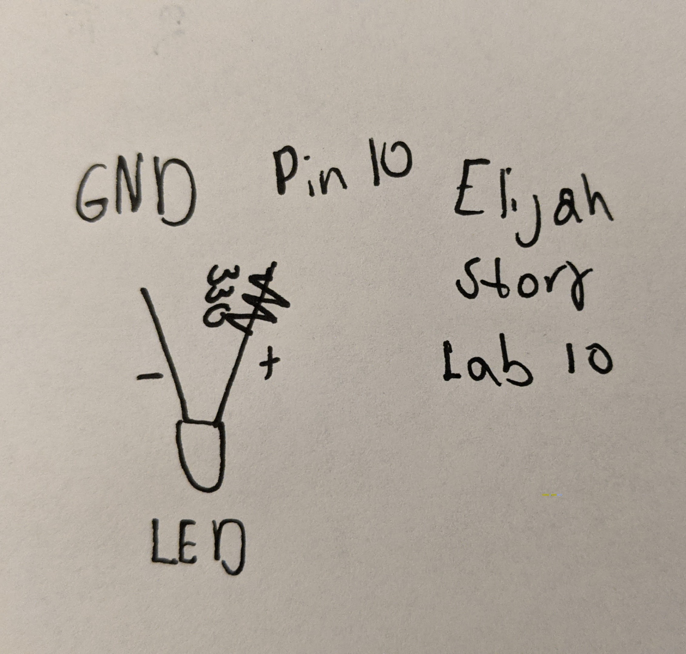
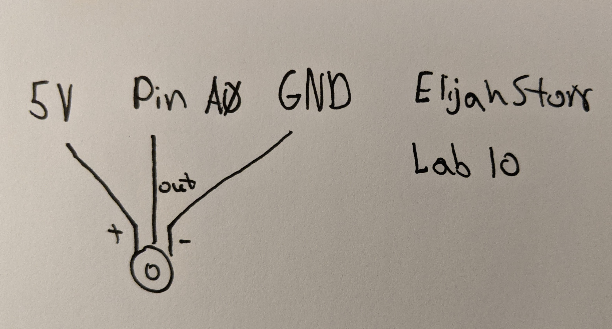

# Lab10-Elijah-Story

## #1
- The serial port is used to allow the arduino to talk to the computer and visa versa. It also allows the arduino to talk to other boards. The baud rate is like a chanal. It basically says how often either side should read or write information. When using the serial port, both sides need to agree on the baud rate as well as what the data being passed means (HIGH = 1, LOW = 0).

## #2
- Below is a diagram of the wiring. It is a very simple circuit that just includes an LED. The LED gets the power that comes from pin 10, passes through a 330 resistor and out to ground. Here is the [video](https://photos.app.goo.gl/jVhtu77vFw67X3Fm9) for this part.

- Below is a diagram of the wiring for the potentiometer. It gets power from 5V and is also connected to ground. The output is connected to analog pin A0. Here is the [video](https://photos.app.goo.gl/LmdenG8rq8yvF9pu7) for this part.

In the first example the information started with the computer and ended at the arduino. The trigger was whenever the arduino had a new thing to read. However, it only did something when “h” or “l” was something it read. The output was the LED.

In the second example the information started with the arduino and ended at the computer. There was no trigger exactly. The information was constantly flowing. The only difference was the output from the arduino was different based on the potentiometer.

You can not have more than one port open at once. The port is a 2 way road that can get clogged. It also just won't let you.

The reason we scale the output of the potentiometer, is so that the data going to the port is 8 bits not 10.
## #3
- The potentiometer changes the ball position because of the data it is outputting. The arduino is sending out a value between 0 and 255. Processing is reading that information and updating the x position just like it does with another variable change.
- For the [video](https://photos.app.goo.gl/Z9PuE3rHv18abqv8A), I am using Serial-potentipmeter1 for the input and potentipmeter_reader1 for the output.
- In the tutorial, There looks to be some lag between the potentiometer and the ball in processing, but I didn't see that for my own code.
## #4
- Here is the [video](https://photos.app.goo.gl/UXmFse7Cd6ZCgAnF7) of the final version.
- The ball moves across the entire screen by mapping what a value would be in the original state to what it is in the new state. It takes the total range of the new state and divides it by the range of the original state. In my code, the input from the port is multiplied by 3.137.
- To reduce latency, the arduino only sends info when processing asks for it. This reduces the amount of data being sent and read.
- Over all I learned how to read and write to the serial port on both arduino and processing. I learned a bit about the behind the scenes stuff which will make implementing this into my game easier. Knowing that it is better to ask for the data instead of constantly sending it, will be good to know considering that I assume the sensor I want to use will need to send a lot of data. It may also make it easier to ask for different types of data individually instead of all at once. I just need to make sure that I can send unique data back to arduino so it knows what kind of data to return.
